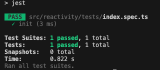

# README
## reactivity
1. 初始化环境 npm init -y
2. 规定目录 src/reactivity，目录下有对应的test文件夹和index.ts
3. typescript环境
- 安装typescript npm install typescript
- npx tsc --init，此时新增一个文件tsconfig.json
4. 准备jest环境
- npm install jest @types/jest --dev
- tsconfig中配置 "types": ["jest"]
- jest是运行在浏览器环境中，只支持commonjs规范，不支持esmodule，所以通过安装babel对esmodule转换`npm install --save-dev babel-jest @babel/core @babel/preset-env`
- package.json script 中增加 "test": "jest"，然后运行npm run test则开始遍历目录，运行test文件了

## reactive and effect

## scheduler 任务调度器
通过effect的第二个参数给定的一个scheduler的fn
effect第一次执行的时候还会执行fn
当响应式对象 set update 不会执行fn 而是执行scheduler
当如果执行runner耳朵时候，会再次执行fn

## stop

stop(runner)调用之后 effect副作用函数不再更新，也就是当调用stop的时候，清除掉effect

## onStop
调用stop的时候，如果有onStop则onStop函数调用一次

